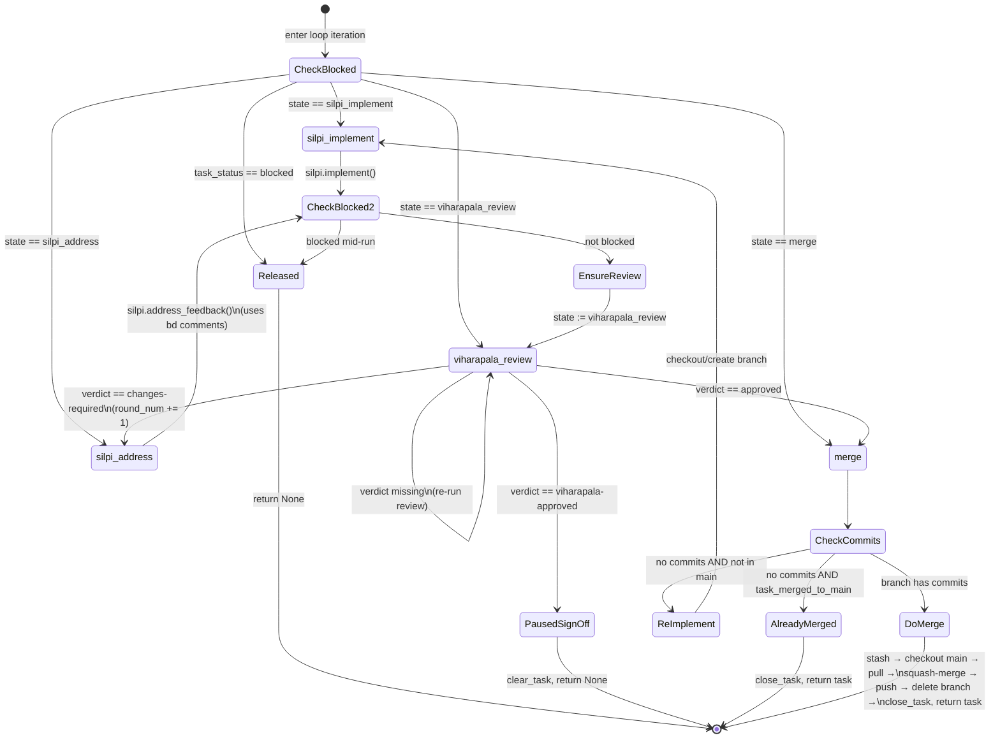

# Shreni — Technical Design

## Overview

Shreni is an autonomous multi-agent coding system built on the Claude Agent SDK. It takes a backlog of tasks from a `bd` (Beads) issue tracker and implements them end-to-end: writing code, running tests, reviewing changes, and merging to `main` — without human involvement for routine tasks.

---

## CLI Commands

```
shreni init --repo /path/to/repo [--project-name MyProject]
shreni run  --repo /path/to/repo [--project-name MyProject]
shreni logs --repo /path/to/repo [--task <id>] [--raw]
```

| Command | Purpose |
|---------|---------|
| `init` | One-time project setup: prerequisites check, bd init, DoltHub backup, CLAUDE.md, observability tree |
| `run`  | Run the orchestrator against the task backlog; requires init to have been run first |
| `logs` | Inspect per-task spans/events under `~/.shreni/projects/<slug>/` |

`shreni --repo ...` (no subcommand) is equivalent to `shreni run` for backward compatibility.

---

## System Architecture

```
┌────────────────────────────────────────────────────────────────┐
│                        Sthapathi (orchestrator)                │
│                                                                │
│  ┌──────────┐   implement/address   ┌────────────────────┐    │
│  │  Silpi   │ ◄──────────────────── │    task_loop.py    │    │
│  │  (impl)  │ ──────────────────►   │                    │    │
│  └──────────┘   ready-for-review    │  returns task dict │    │
│                                     │  on merge          │    │
│  ┌──────────────┐   review          │                    │    │
│  │  Viharapala  │ ◄─────────────── │                    │    │
│  │  (reviewer)  │ ──────────────►  │                    │    │
│  └──────────────┘  approved /       └────────────────────┘    │
│                    changes-required          │                 │
│                                             enqueue            │
│                                              │                 │
│                              ┌──────────────▼──────────────┐  │
│                              │  parikshaka-queue.json       │  │
│                              │  (persistent, crash-safe)    │  │
│                              └──────────────┬──────────────┘  │
│                                             │                  │
│                              ┌──────────────▼──────────────┐  │
│                              │  _parikshaka_worker          │  │
│                              │  (background anyio task)     │  │
│                              └──────────────┬──────────────┘  │
│                                             │                  │
│                              ┌──────────────▼──────────────┐  │
│                              │  Parikshaka (QA agent)       │  │
│                              │  creates bug / e2e tasks     │  │
│                              └─────────────────────────────┘  │
└────────────────────────────────────────────────────────────────┘
                        │
                        │ reads/writes
                        ▼
               ┌─────────────────┐
               │   bd (Beads)    │
               │  issue tracker  │
               └─────────────────┘
```

### Agents

| Agent | Role | Execution model |
|-------|------|-----------------|
| **Sthapathi** | Master orchestrator — picks tasks, drives the loop, manages lifecycle | Main async process |
| **Silpi** | Implementer — writes code, tests, commits | Claude SDK sub-agent |
| **Viharapala** | Code reviewer — runs quality gates, writes review comments, sets verdict | Claude SDK sub-agent |
| **Parikshaka** | QA examiner — runs e2e suite, creates bug and e2e-test tasks | Claude SDK sub-agent (background worker) |

---

## Module Layout

```
shreni/
├── sthapathi.py          # CLI entry point: routes init/run/logs subcommands + orchestrator loop
├── init.py               # shreni init: prerequisites check, bd setup, DoltHub, CLAUDE.md, ~/.shreni dir
├── backup.py             # bd → DoltHub backup cron (dolt push every 5 min)
├── context.py            # Runtime dataclass (repo_root, project_name, queue file path, ~/.shreni paths)
├── observability.py      # Span/event emission to ~/.shreni/projects/<slug>/...spans.jsonl
├── bd.py                 # All Beads CLI interactions
├── state.py              # Crash-recovery state files (.claude/)
├── git.py                # Git operations (branch, merge, push)
├── shell.py              # Logging (log, make_logger) and slugify
├── plugins.py            # Claude Code plugin resolution
├── agents/
│   ├── runner.py         # Generic Claude SDK runner — wraps each agent run in a span,
│   │                     # writes per-task + aggregate logs, emits one event per tool call
│   ├── silpi.py          # Silpi prompt builders (implement, address_feedback, breakdown_epic, init_project)
│   ├── viharapala.py     # Viharapala prompt builder (review)
│   └── parikshaka.py     # Parikshaka prompt builder (quality_check)
├── cli/
│   └── logs.py           # `shreni logs` viewer over ~/.shreni span streams
└── workflow/
    ├── task_loop.py      # implement → review → (address → review)* → merge; returns task on merge
    ├── epic.py           # Epic breakdown: invoke Silpi to decompose approved epics
    └── resume.py         # Crash recovery: find and resume in-progress work
```

Agent prompt files (Markdown, loaded by `runner.py` as system prompts):

```
silpi/
├── AGENTS.md             # Silpi instructions: implementation loop, e2e tasks, epic breakdown, rules
├── SOUL.md               # Silpi persona and values
└── .claude/settings.json # frontend-design plugin enabled at project scope

viharapala/
├── AGENTS.md             # Viharapala instructions: code review and epic design review
├── SOUL.md               # Viharapala persona and values
└── skills/bd-review/SKILL.md

parikshaka/
├── AGENTS.md             # Parikshaka instructions: run e2e, triage regressions and coverage gaps
└── SOUL.md               # Parikshaka persona and values
```

---

## Project Initialisation (`shreni init`)

`init.py` runs in two phases. If any prerequisite is missing it prints the exact steps needed and exits — the user re-runs `shreni init` after completing them.

### Phase 1 — Machine prerequisites (one-time per machine)

| Check | Command | Failure action |
|-------|---------|----------------|
| `bd` installed | `which bd` | Print install link, exit |
| `claude` installed | `which claude` | Print install link, exit |
| `dolt` installed | `which dolt` | Print `brew install dolt`, exit |
| Dolt credentials exist | `dolt creds ls` | Print steps: `dolt creds new` + add key to DoltHub, exit |
| Credentials verified | `dolt creds check --endpoint doltremoteapi.dolthub.com:443` | Print verification steps, exit |

The `User:` value from `dolt creds check` is parsed and used as the DoltHub username for subsequent steps.

### Phase 2 — Per-project setup

| Step | Command / Action |
|------|-----------------|
| 1 | `bd init --prefix <slug>` — initialises embedded Dolt + sets issue prefix (e.g. `myapp-1`) |
| 2 | Append backup config to `.beads/config.yaml`: `enabled: true, git-push: false, interval: 15m` |
| 3 | Prompt user to create the DoltHub repo (`<prefix>-beads`) at dolthub.com, then press Enter |
| 4 | `bd dolt remote add origin https://doltremoteapi.dolthub.com/<user>/<prefix>-beads` |
| 5 | `cd .beads/embeddeddolt/<prefix> && dolt push origin main` (direct dolt — bypasses `bd dolt push` port bug) |
| 6 | Install backup cron: `*/5 * * * * cd .beads/embeddeddolt/<prefix> && dolt push origin main` |
| 7 | Create `.parikshaka-ignore` in the target repo with a commented template (skipped if the file already exists) |
| 8 | Run graphify: `graphify claude install` + `graphify hook install` |
| 9 | Run Silpi to create `CLAUDE.md` |

**Key constraints learned from production use:**
- `git-push: false` prevents beads backup commits racing with agent commits on `main`
- `bd dolt push` has a port bug in server mode; use `dolt push` directly from the embedded repo path
- DoltHub repo must exist before the first push — push fails silently with "permission denied" if it doesn't
- The DoltHub remote URL must use the `User:` value from `dolt creds check`, not an email or login name

### `shreni run` precondition

`shreni run` checks for `CLAUDE.md` on startup and exits with a clear error if it is missing:

```
ERROR: CLAUDE.md not found in /path/to/repo
Run project initialisation first:
  shreni init --repo /path/to/repo
```

---

## bd Storage Layout

Beads stores its data in the target repo under `.beads/`:

```
<repo>/
└── .beads/
    ├── config.yaml               # Backup config (interval, git-push flag)
    └── embeddeddolt/
        └── <prefix>/             # Embedded Dolt database (the actual issue store)
            ├── dolt_config.json
            └── ...
```

The backup cron and initial push target `.beads/embeddeddolt/<prefix>/` directly.

---

## Key Data Flows

### Task lifecycle

```
bd task (ready)
    │
    ▼
Sthapathi claims task → create feature branch
    │
    ▼
task_loop.py — state machine
    │
    ├── silpi_implement ──► Silpi writes code + tests + commits
    │                           └─► bd set-state review=ready-for-review
    │
    ├── viharapala_review ──► Viharapala runs quality gates, writes comment
    │                             ├─► review=approved → merge state
    │                             ├─► review=changes-required → silpi_address
    │                             └─► review=viharapala-approved → pause for author
    │
    ├── silpi_address ──► Silpi fixes blocking issues → resubmits
    │
    └── merge ──► squash-merge → main → push → close task
                      │
                      └─► returns task dict to Sthapathi
                                │
                                ▼
                     enqueue_parikshaka(task)  ← writes to parikshaka-queue.json
                                │
                                ▼
                     send to in-memory queue ──► _parikshaka_worker (background)
                                                       │
                                                       ▼
                                              Parikshaka quality_check()
                                                  ├── run e2e suite
                                                  ├── bug tasks (label=parikshaka) on regression
                                                  └── e2e tasks (label=e2e) on coverage gap
                                                       │
                                                       ▼
                                              dequeue_parikshaka(task_id)  ← removes from file
```

### Ghost-merge guard

Before every squash-merge, `task_loop.py` checks `branch_has_commits(branch, ctx)` — i.e. `git log main..<branch> --oneline` is non-empty. If the branch exists but has no commits (Silpi failed to commit), it re-routes to `silpi_implement` instead of merging an empty branch. The same guard applies in `resume.py` when picking up `review:approved` tasks.

### Parikshaka parallel execution

The main loop and the Parikshaka worker run as two concurrent `anyio` tasks inside a `TaskGroup`:

```
Main loop                             Parikshaka worker
─────────────────────────────         ─────────────────────────────
Task A: implement → review → merge ──► queue.send(A)
Task B: implement → review → merge ──► queue.send(B)    quality_check(A) running
Task C: implement → review → merge ──► queue.send(C)    quality_check(B) running
                                                        quality_check(C) running
```

Parikshaka processes tasks one at a time in the order they merged. The main loop never waits for it.

### Persistent queue crash safety

```
Merge completes
    │
    ├─► enqueue_parikshaka()  writes entry to parikshaka-queue.json  ← survives crash
    │
    └─► send to in-memory channel ──► worker picks it up
                                           │
                                    quality_check() runs
                                           │
                                    dequeue_parikshaka()  removes entry from file
```

On next startup, `load_parikshaka_queue()` reads any entries still in the file and replays them into the worker before the main loop starts.

### Epic lifecycle

```
Author creates epic in bd
    │
    ▼
Sthapathi picks up epic (type=epic, label=review:approved pending)
    │
    ▼
Silpi proposes design (comment on epic)
    │
    ▼
Viharapala reviews design → sets review=viharapala-approved
    │
    ▼
Author reviews → sets review=approved (manual step)
    │
    ▼
Sthapathi runs epic breakdown → Silpi decomposes into feature tasks
    │
    ▼
Silpi sets breakdown=complete → feature tasks picked up as normal tasks
```

---

## State Management

### Task state machine

The per-task state machine in [shreni/workflow/task_loop.py](shreni/workflow/task_loop.py):



Three terminal exits:

| Exit | Trigger | Caller sees |
|------|---------|-------------|
| `return task` | Squash-merge succeeded, or task was already merged to main | Task complete; orchestrator enqueues for Parikshaka |
| `return None` (paused) | `verdict == viharapala-approved` (epic awaiting author sign-off) | Orchestrator releases the task; resumes after author marks `approved` |
| `return None` (released) | `task_status == blocked` at any check point | Orchestrator picks up other ready tasks; this one re-claimed when deps merge |

### Crash recovery (`state.py`)

Three JSON files under `<repo>/.claude/`:

| File | Purpose |
|------|---------|
| `current-task.json` | Records the active task, branch, round, and state so the orchestrator can resume after a crash |
| `epic-breakdown.json` | Records an in-progress epic breakdown to allow retry if interrupted |
| `parikshaka-queue.json` | Persistent list of merged tasks awaiting Parikshaka quality checks; survives crashes |

`resume.py` checks four sources in priority order on startup:

1. `current-task.json` state file
2. Current git branch (if it looks like a feature branch)
3. Tasks with `label=review:ready-for-review` → resume at `viharapala_review`
4. Tasks with `label=review:approved` (non-epic) and `branch_has_commits` → resume at `merge`; otherwise resume at `silpi_implement`

### bd label conventions

| Label | Set by | Meaning |
|-------|--------|---------|
| `review:ready-for-review` | Silpi | Submitted for review; Viharapala should pick it up |
| `review:changes-required` | Viharapala | Blocking issues found; Silpi must address |
| `review:approved` | Viharapala / Author | Approved; orchestrator will merge |
| `review:viharapala-approved` | Viharapala | Epic design approved; awaiting author sign-off |
| `breakdown:complete` | Silpi | Epic decomposed into feature tasks |
| `manual` | Human | Bug reported by a human |
| `parikshaka` | Parikshaka | Regression bug detected by the QA agent |
| `e2e` | Parikshaka | Missing e2e coverage task, to be implemented by Silpi |

---

## Parikshaka Triage Logic

Parikshaka is an examiner, not an implementer. After each merge it:

1. **Reads the ignore list** — loads `.parikshaka-ignore` from the project root if it exists. Any test whose full name matches a pattern is silently excluded from all subsequent steps. Patterns are substring or glob matches; `*` is the wildcard; lines starting with `#` are comments.
2. **Runs the existing e2e suite** — discovers the command from CLAUDE.md / package.json / pyproject.toml / Makefile
3. **Reports regressions** — creates `type=bug, label=parikshaka, priority=1` tasks for each failing test not in the ignore list (deduplicates against open bugs). Cross-browser toast failures are consolidated into a single task rather than one per browser.
4. **Identifies coverage gaps** — creates `type=feature, label=e2e` tasks describing the missing user journey (only for user-visible behaviour: new pages, forms, API endpoints, user-facing bug fixes). Ignored tests are not counted as coverage gaps.

Silpi picks up `e2e`-labelled tasks and writes the tests; they go through the normal Viharapala review cycle.

### `.parikshaka-ignore` format

```
# Lines starting with # are comments
smoke: homepage is reachable          # exact substring match
Admin — Users panel: *               # glob — suppresses all tests in this group
```

`shreni init` creates this file automatically with a commented template if it does not already exist.

**Coverage decision table:**

| Completed work | e2e task needed? |
|----------------|-----------------|
| New page, route, or screen | ✅ |
| New form, modal, or multi-step flow | ✅ |
| New API endpoint the UI depends on | ✅ |
| User-visible bug fix with no existing regression test | ✅ |
| Refactor / rename with no behavioural change | ❌ |
| Database migration, background job, infrastructure | ❌ |
| Config, env vars, build tooling, docs | ❌ |
| Already covered by an existing test | ❌ |

---

## Agent SDK Integration

`agents/runner.py` wraps `claude_agent_sdk.query()`. Each agent invocation:

1. Loads the agent's `AGENTS.md` as the system prompt (via `load_agent_prompt`)
2. Injects a user-turn message built by the calling module (e.g. `silpi.implement`)
3. Passes `ClaudeAgentOptions(cwd=repo_root)` so the agent operates inside the target repo
4. Optionally passes `SdkPluginConfig` entries (Silpi loads `frontend-design@claude-code-plugins`)

The `cwd` is always the **target repo**, not the Shreni project root. The agent prompt files live in the Shreni project and are loaded by path before the SDK call.

---

## Plugin System

Silpi uses the `frontend-design` Claude Code marketplace plugin for UI/frontend tasks. The plugin is:

- Installed via `uv run install-plugins` (runs `claude plugin install frontend-design@claude-code-plugins`)
- Registered at project scope in `silpi/.claude/settings.json`
- Resolved at runtime by `plugins.py` → passed as `SdkPluginConfig` to `run_agent`
- Invoked inside Silpi's session via `/frontend-design` when the task involves UI work

`plugins.py` returns `None` if the plugin is not installed; Silpi still runs but without the design guidelines.

---

## bd CLI Workarounds

The `bd query` command cannot parse colons in label values (e.g. `label=review:approved` fails). All label-based lookups use:

```python
bd list --json  # returns all tasks
# then filter in Python: [t for t in tasks if label in (t.get("labels") or [])]
```

Similarly, `bd` does not automatically set epics to `in_progress` when child tasks start. Sthapathi infers which epic group is active by finding the `parent` IDs of tasks with `status=in_progress`.

---

## Configuration

All runtime configuration flows through the `Context` dataclass. There are no global variables.

| Field | Source | Purpose |
|-------|--------|---------|
| `repo_root` | `--repo` CLI arg | Target repository path |
| `project_name` | `--project-name` or `repo_root.name` | Used in agent prompts and bd prefix |
| `agents_dir` | Shreni project root | Locates `silpi/`, `viharapala/`, `parikshaka/` prompt dirs |
| `idle_interval` | Hardcoded default 120s | Sleep time when no tasks are ready |

Path properties on `Context` (all under `<repo>/.claude/`):

| Property | File | Purpose |
|----------|------|---------|
| `task_state_file` | `current-task.json` | Active task crash recovery |
| `epic_breakdown_file` | `epic-breakdown.json` | Epic breakdown crash recovery |
| `parikshaka_queue_file` | `parikshaka-queue.json` | Persistent Parikshaka work queue |

---

## Logging

Each agent has a named logger produced by `make_logger(agent_name)`. Output is ANSI-coloured for dark terminals:

| Agent | Colour |
|-------|--------|
| Timestamp | Dark gray |
| Sthapathi | Bright cyan |
| Silpi | Bright green |
| Viharapala | Bright yellow |
| Parikshaka | Bright magenta |

```
[2026-04-25 10:15:32] [Sthapathi] Task T-42: Add user authentication
[2026-04-25 10:15:33] [Silpi] [Round 1] implement T-42
[2026-04-25 10:28:11] [Viharapala] [Round 1] review T-42
[2026-04-25 10:29:00] [Sthapathi] Task T-42 complete.
[2026-04-25 10:29:01] [Sthapathi] Task T-43: Add password reset
[2026-04-25 10:29:01] [Parikshaka] Quality check for T-42 ('Add user authentication')...
```

Parikshaka logs appear interleaved with the main loop — it runs in the background while the next task is already being implemented.

---

## Observability

The free-form stdout log above is for humans watching live. For going back later — comparing rounds across tasks, asking "what did Silpi spend time on?", debugging a stuck task — Shreni writes a parallel structured stream rooted at `~/.shreni/`.

### Storage layout

```
~/.shreni/
└── projects/
    └── <project_slug>/                  ← one per Shreni project
        ├── silpi.log                    ← per-agent aggregate (tmux tails these)
        ├── viharapala.log
        ├── parikshaka.log
        ├── session-spans.jsonl          ← spans/events with no task context
        └── tasks/
            └── <task_id>/               ← one per bd task touched by Shreni
                ├── spans.jsonl          ← structured timeline for this task
                ├── silpi.log            ← Silpi raw output for this task only
                ├── viharapala.log
                └── parikshaka.log
```

`<project_slug>` is `slugify(project_name)`. The directory tree is created by `shreni init` (`_ensure_observability_dir`) and lazily by the runtime when a span needs to be written. Files are append-only — old runs accumulate. Crash-recovery state still lives in the target repo's `.claude/` (it must travel with the repo, not the user).

### Span model

Each line in `spans.jsonl` is one JSON object — OpenTelemetry-flavoured but flat:

| Field | Type | When |
|-------|------|------|
| `ts` | ISO-8601 UTC | always |
| `type` | `span_start` \| `span_end` \| `event` | always |
| `name` | string (e.g. `silpi.implement`, `tool_call`) | always |
| `span_id` | 16-hex chars | spans only |
| `parent_span_id` | 16-hex chars | when nested |
| `agent` | `silpi` \| `viharapala` \| `parikshaka` | when emitted by/for an agent |
| `task_id` | bd task id | when in a task context |
| `attrs` | object | freeform context (tool, command, file_path, verdict, ...) |
| `duration_ms` | number | `span_end` only |
| `status` | `ok` \| `error` | `span_end` only |
| `error` | string | `span_end` when status=error |

Spans nest via `contextvars`, so call sites do not thread span ids through every function:

```
session                                 ← session-spans.jsonl
└── task[T-42]                          ← tasks/T-42/spans.jsonl
    ├── silpi.implement
    │   ├── tool_call (Bash: pytest)
    │   └── tool_call (Edit: src/auth.py)
    ├── viharapala.review
    │   └── tool_call (Bash: pytest)
    ├── (review_verdict event: approved, round=1)
    └── (task_merged event)
```

The session span lives in `session-spans.jsonl`; everything tagged with a `task_id` lands in the task's own `spans.jsonl`. The two streams cross-reference via `parent_span_id`.

### Where spans are emitted

| Span / event | Emitter |
|--------------|---------|
| `session` (root span) | `sthapathi.main` |
| `task` (per-task root) | `workflow.task_loop.run_task_loop` |
| `silpi.implement` / `silpi.address_feedback.round_N` / `silpi.init_project` / `silpi.breakdown_epic` | `agents.silpi` (via runner) |
| `viharapala.review` | `agents.viharapala` (via runner) |
| `parikshaka.quality_check` (task) / `parikshaka.background_check` (worker) | `agents.parikshaka` + `sthapathi._parikshaka_worker` |
| `tool_call` event (one per tool use) | `agents.runner.run_agent` |
| `agent_finished` event (with tool_calls count) | `agents.runner.run_agent` |
| `task_picked_up` event | `sthapathi._main_loop` |
| `review_verdict` event | `workflow.task_loop` |
| `task_merged` event | `workflow.task_loop` |

The `agents.runner.run_agent` helper wraps every Claude SDK invocation in a span and tees output to two files:
- `~/.shreni/projects/<slug>/<agent>.log` — aggregate, used by tmux pane tailing.
- `~/.shreni/projects/<slug>/tasks/<task_id>/<agent>.log` — per-task, when the call site supplied a `task_id`.

### Reading the stream

```
shreni logs --repo /path/to/repo                  # list tasks observed
shreni logs --repo /path/to/repo --task T-42      # formatted timeline
shreni logs --repo /path/to/repo --task T-42 --raw  # JSONL passthrough for jq / piping
```

The formatted timeline collapses each line to `HH:MM:SS  type  agent  name  [extras]`. Use `--raw` for downstream processing (e.g. piping to `jq` or feeding into a viewer).

### Failure tolerance

Observability is a side channel. The span emitter never raises in user-facing code paths — a failed write degrades to a missing log line, not a crashed task. Files are opened in append mode, so concurrent agent runs can write simultaneously without coordination (each agent invocation owns its own line writes through Python's GIL-protected `write`).

---

## Dependencies

| Package / Tool | Purpose |
|----------------|---------|
| `claude-agent-sdk` | Claude sub-agent runner |
| `anyio` | Async runtime and memory object streams for the Parikshaka background worker |
| `bd` (CLI, external) | Beads issue tracker — task management |
| `dolt` (CLI, external) | Dolt CLI — DoltHub credential management and direct push |
| `claude` (CLI, external) | Claude Code CLI — plugin installation |
